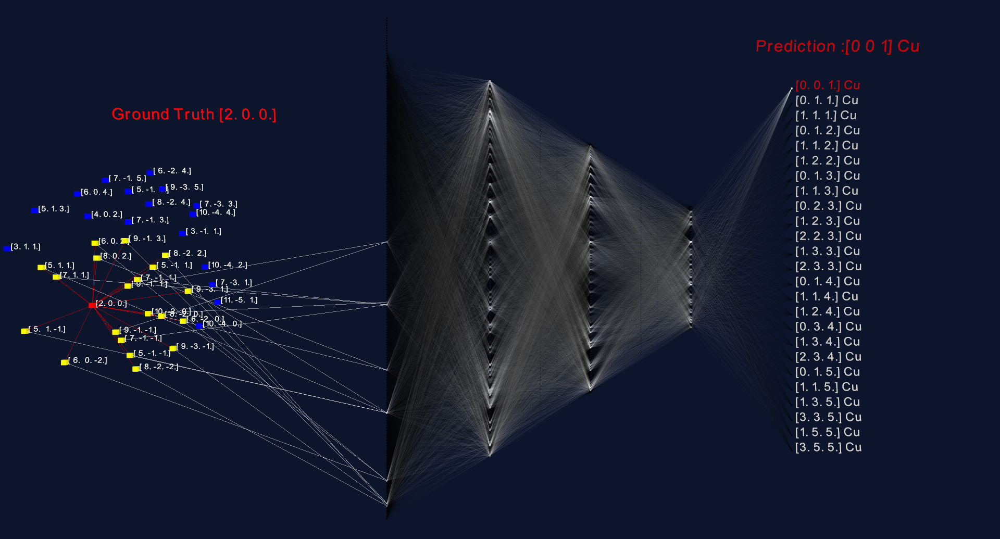

|Supported Platforms| |GitHub tag|
|PyPI| |PyPI pyversions|
|Publish_Conda_PyPI| |Conda|
|contributions welcome|

.. |Supported Platforms| image:: https://img.shields.io/conda/pn/bm32esrf/lauetoolsnn?color=green&label=supported%20platform
   :target: https://anaconda.org/bm32esrf/lauetoolsnn

.. |GitHub tag| image:: https://img.shields.io/github/v/tag/BM32ESRF/LaueNN?color=blue&label=Github%20tag
   :target: https://github.com/BM32ESRF/LaueNN

.. |PyPI| image:: https://img.shields.io/pypi/v/lauetoolsnn
   :target: https://pypi.python.org/pypi/lauetoolsnn/
   
.. |PyPI pyversions| image:: https://img.shields.io/pypi/pyversions/lauetoolsnn.svg
   :target: https://pypi.python.org/pypi/lauetoolsnn/

.. |Publish_Conda_PyPI| image:: https://github.com/BM32ESRF/LaueNN/actions/workflows/complete_workflow.yml/badge.svg
   :target: (https://github.com/BM32ESRF/LaueNN/actions/workflows/complete_workflow.yml

.. |Conda| image:: https://img.shields.io/conda/v/bm32esrf/lauetoolsnn?style=flat-square
   :target: https://anaconda.org/bm32esrf/lauetoolsnn

.. |contributions welcome| image:: https://img.shields.io/badge/contributions-welcome-brightgreen.svg?style=flat
   :target: https://github.com/BM32ESRF/LaueNN/issues

.. include:: README.rst

Table of contents
=================

.. toctree::
   :maxdepth: 2
   :caption: What exactly are we predicting:

   idea_lauenn/installation.rst
   
   
.. toctree::
   :maxdepth: 2
   :caption: Installation:

   installation/installation.rst
   issues/installation.rst

.. toctree::
   :maxdepth: 2
   :caption: Usage of console functions:
   
   usage
   
   
.. toctree::
   :maxdepth: 2
   :caption: LaueNN GUI:
	
   GUi_functions/config_file.rst
   GUi_functions/installation.rst

.. toctree::
   :maxdepth: 2
   :caption: Jupyter Notebook:

   ipynb_lauenn/installation.rst

.. toctree::
   :maxdepth: 2
   :caption: Python scripts:

   py_scripts/installation.rst

.. toctree::
   :maxdepth: 2
   :caption: Multi-mat LaueNN:

   multi_mat/installation.rst

.. toctree::
   :maxdepth: 2
   :caption: Additional scripts:
   
   pp_scripts/installation.rst
   
   
.. toctree::
   :maxdepth: 2
   :caption: Tutorial video:
   
   video_demo/installation.rst

.. toctree::
   :maxdepth: 2
   :caption: Funding and Pubs:
   
   funding/installation.rst
   pubs/installation.rst
   
   
.. toctree::
   :maxdepth: 2
   :caption: Contact:
   
   AUTHORS.rst
